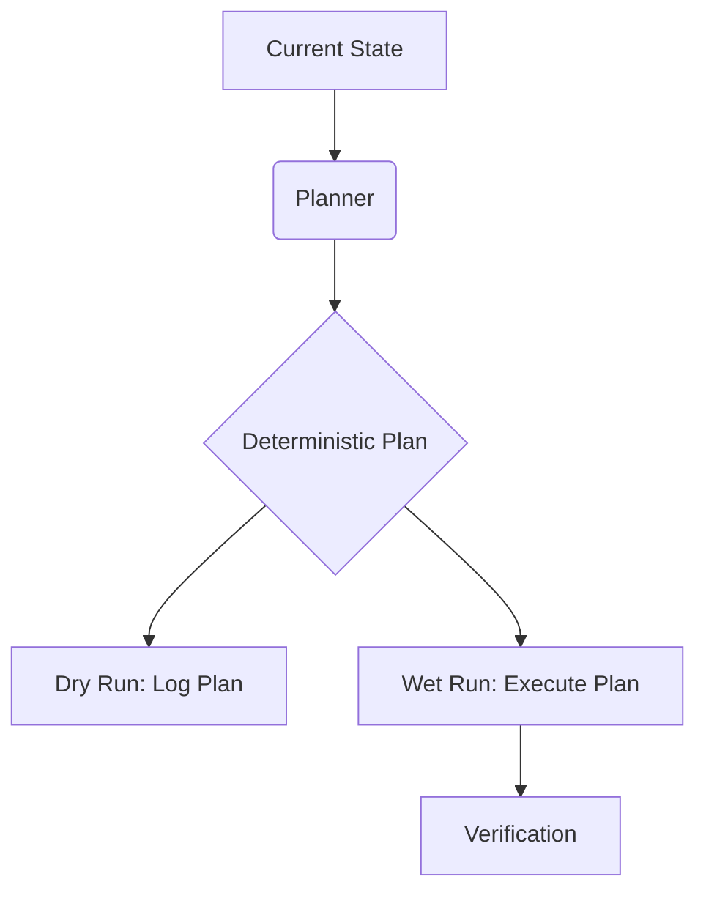

Adding a `--dry-run` flag is often the first thing a developer does when writing a destructive script. It feels like a safety net—a way to "look before you leap." But in most systems, this flag is implemented as a simple conditional scattered throughout the codebase. When the script grows in complexity, this pattern doesn't just fail; it actively deceives.

### The Real Problem

The fundamental issue with most dry-run implementations is that they are **not representative**.

When a dry run is implemented as `if (dryRun) { print(msg); } else { doWork(); }`, the "dry" path and the "hot" path diverge. Over time, the logic required to prepare for `doWork()`—fetching credentials, validating state, checking permissions—drifts. You end up in a situation where the dry run succeeds because the `print` statement worked, but the wet run fails because a database connection was dropped or a file permission was missing.

**The dry run becomes a simulation of the *output*, not a simulation of the *execution*.**

### Why This Exists

This pattern exists because of the **Scripting Mindset**. We view scripts as a linear sequence of side-effects. To make it "safe," we wrap each side-effect in a conditional.

| Mindset | Priority | Implementation |
| :--- | :--- | :--- |
| **Scripting** | Immediate Action | `if (!dry) execute()` |
| **Engineering** | Deterministic Intent | `plan = compute(); execute(plan)` |

Engineering intent requires an extra layer of abstraction—a data structure that represents what *should* happen. For a developer trying to finish a migration by Friday, the scripting mindset is a path of least resistance that incurs massive architectural debt.

### The Missing Model: Reified Intent

To build truly reliable systems, we must move to the **Reified Intent Model**. In this model, "The Plan" is a first-class citizen—a data structure that is computed, validated, and only then executed.

**The Flow of Reified Intent:**

By reifying the intent (turning it into a "thing"), you ensure that the logic used to decide *what* to do is identical in both dry and wet modes. The only difference is the final consumer of the plan object.

### Tradeoffs and Failure Modes

This model is not free.

1. **Serialization Overhead**: You must be able to represent every possible action as a data structure (e.g., JSON). This is easy for `DeleteUser` but hard for complex, multi-stage transformations that depend on intermediate results.
2. **The Observation Gap**: If the system's state changes between the "Plan" phase and the "Execute" phase (a race condition), the plan may become invalid.
3. **Complexity Ceiling**: For a 10-line script, a formal Plan object is overkill. The failure mode here is **Architecture Astronautics**—building a planning engine for a task that just needed a manual backup.

### Second-Order Effects

When you adopt Reified Intent, the benefits extend beyond just safety:

*   **Audit Trails**: The "Plan" object is a perfect audit log of intended actions before they happen.
*   **Manual Gates**: You can easily inject a "Human-in-the-Loop" step where a senior engineer reviews the JSON plan before it hits production.
*   **Rollback for Free**: If your actions are reversible, the "Plan" object can automatically generate its own "Inverse Plan."

By treating intent as a data structure rather than a side-effect, we transform our tools from dangerous black boxes into transparent, verifiable systems.
